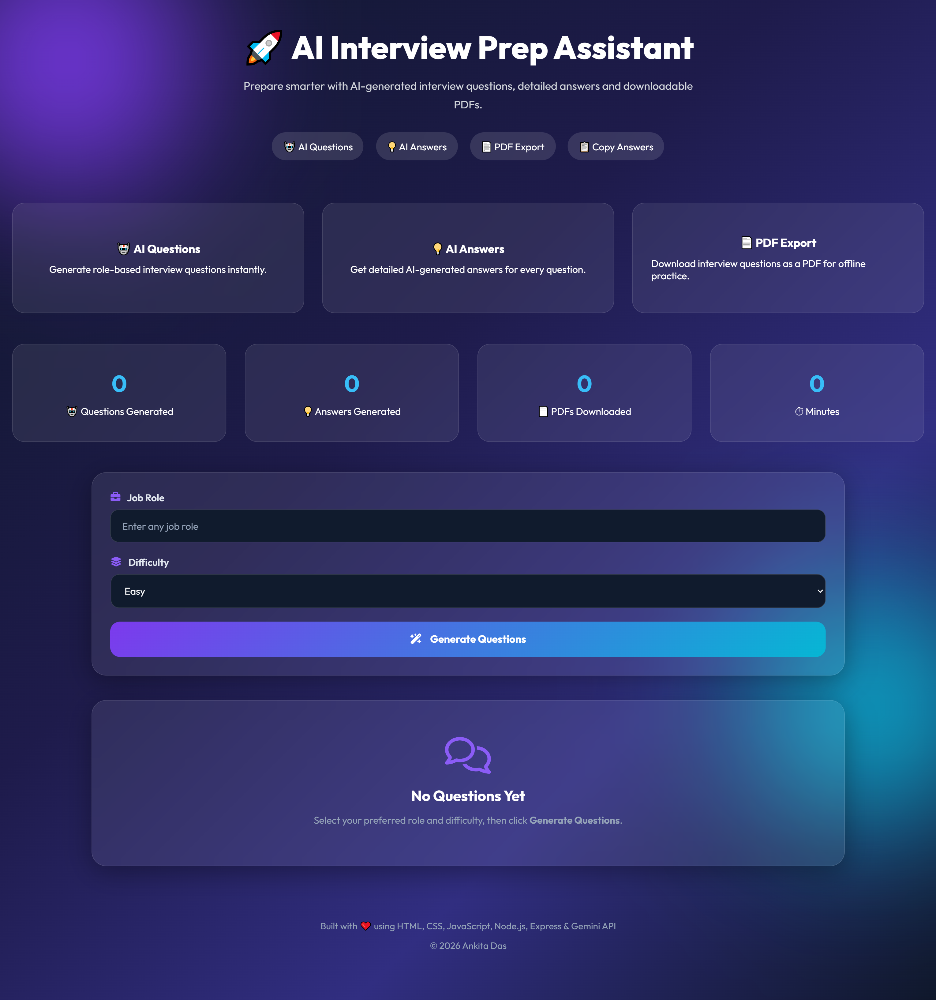
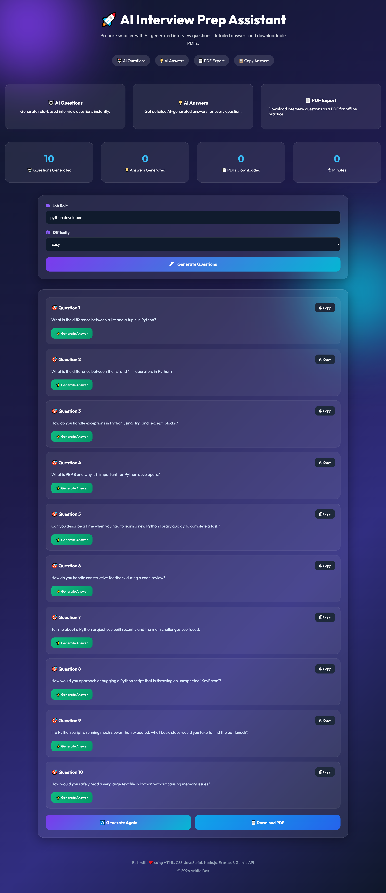
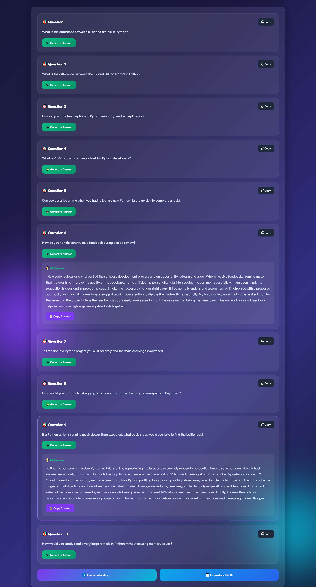
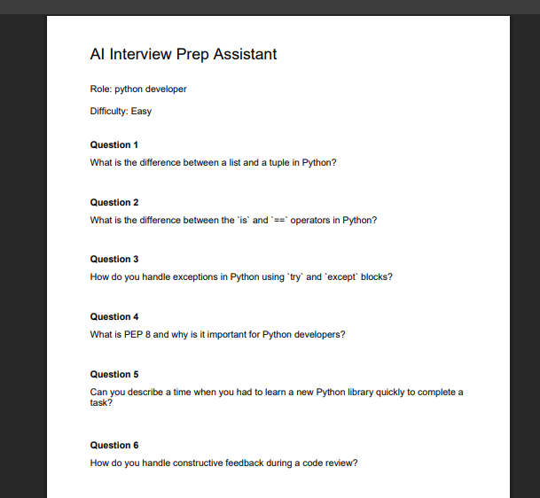

# 🤖 AI Interview Prep Assistant

An AI-powered interview preparation web application that generates role-specific interview questions and AI-generated answers. It helps job seekers practice technical and behavioral interviews with a clean and responsive user interface.

---

## 📌 Features

- 🎯 Enter any job role (e.g., Python Developer, Java Developer, Data Analyst)
- 🧠 Generate AI-powered interview questions
- 💡 Generate AI answers for each question
- 📋 Copy individual questions and answers
- 📄 Download interview questions and answers as a PDF
- 📊 Dashboard showing generated questions, answers, and downloads
- 📱 Responsive modern UI with glassmorphism design

---

## 🛠️ Technologies Used

### Frontend
- HTML5
- CSS3
- JavaScript

### Backend
- Node.js
- Express.js

### AI
- Google Gemini API

### Other Libraries
- jsPDF
- dotenv
- CORS

---

## 📂 Project Structure

```text
AI-Interview-Prep/
│
├── index.html
├── style.css
├── script.js
├── server.js
├── package.json
├── .gitignore
├── README.md
└── .env (not uploaded)
```

---

## 🚀 Installation

1. Clone the repository

```bash
git clone https://github.com/AnkitaDas421/AI-Interview-Prep.git
```

2. Open the project

```bash
cd AI-Interview-Prep-Assistant
```

3. Install dependencies

```bash
npm install
```

4. Create a `.env` file

```env
GEMINI_API_KEY=YOUR_API_KEY
```

5. Start the server

```bash
npm start
```

6. Open `index.html` in your browser.

---

## 📸 Screenshots

### 🏠 Home Page


### 🎯 Generated Questions


### 💡 AI Generated Answers


### 📄 PDF Export


## ✨ Future Enhancements

- Multiple AI model support
- Interview timer
- Voice-based interview practice
- Save interview history
- Dark/Light mode

---

## 👩‍💻 Author

**Ankita Das**

B.Tech (Computer Science & Engineering)
